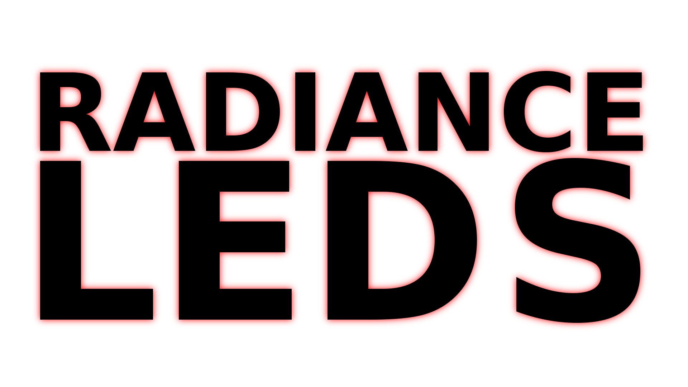

# RadianceLEDs
Arduino project. Contains solution for RGB LED module.

# Download
Source: <b>[RadianceLEDsArduino.ino](https://rgladkyi.github.io/RadianceLEDs/RadianceLEDsArduino/RadianceLEDsArduino.ino)</b>
Git: <b>git clone https://github.com/rgladkyi/RadianceLEDs.git</b>

## Description
Version 0.4

## License
RadianceLEDs is under [GNU General Public License v2](https://www.gnu.org/licenses/old-licenses/gpl-2.0.en.html).

## Credits
Roman Gladkyi.
